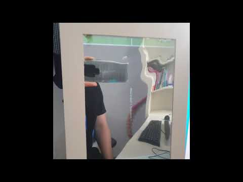



# devspoon-beauty-smart-mirror-apps-tizen
it's tizen hackathon project for beauty AI smart mirror service 

## 팀명 및 팀원 
* **팀명** :  Devspoon 
* **팀장** : 임도현 - Software Part : 기획/설계/개발/서버/SDK/발표
* **개발자** : 강동훈 - Hardware Part : 기획/설계/개발/App
* **디자이너** : 임태연 - Design : 기획/설계/디자인

## 프로젝트 제목
* Beauty AI 스마트미러

## 프로젝트 배경 혹은 목적
* **프로젝트 목적** : 여성 생활 패턴에 가장 많이 사용되는 거울을 IoT 기술과 접목하여 서비스 Hub로서 다양한 기능을 제공하는데 목적을 가지고 있으며 코로나바이러스(COVID-19)로 인해 요구되는 언택트 기술을 제공하고자 화장품 샘플을 배송받아 QR-Code를 인식하여 사용자에게 AI기술이 결합된 최적의 서비스를 제공하고자 함     
 
* **세부 목표**
1. 타이젠 기반 Beauty AI 스마트미러는 음성으로 터치 없이 명령을 실행시키고 탑재된 카메라를 통해 사용자의 얼굴 형태, 피부 상태 등을 인식하여 실시간으로 사용자의 장점을 향상시켜 줄 수 있는 화장 방법을 분석하여 제공함.

2. 사용자가 QR 코드로 제품을 인식시키면 제품의 특성에 따라, 사용자가 보유한 제품들 중 함께 사용하면 좋을 화장품 종류를 알려주고 효율적인 화장 순서 및 방법을 제공함. 이로 인해 사용자는 배송 받은 화장품 샘플과 거울에 비친 사용자의 얼굴을 바탕으로, 전문가 수준의 화장 방법을 비대면, 개인 맞춤형으로 제공받을 수 있음.

## 파일 리스트 
* 프로젝트 저장소
  * Tizen Rest Api Server : https://github.com/devspoon/TizenCloud
  * Tizen AI Beauty Mirror : https://github.com/devspoon/BeautyMirror

* 임도현 수정 파일 리스트
  - ServerSDK.cs (통신 : Modules 폴더)
  - ListPageViewModel.cs (통신 : ViewModels)
  - Tizen Rest Api Server내 모든 파일

* 임태연 수정 파일 리스트
  - ListPage.xamls ( 디자인 : View )

* 강동훈 수정 파일 리스트
  - BeautyMirror\BeautyMirror\MainPage.xaml (main ui)
  - BeautyMirror\BeautyMirror.Tizen\BeautyMirror.Tizen.cs (main ui)

## 코드 기여자 
### **Tizen-Apps**
* Modules/ServerSDK.cs 임도현, 강동훈
* ViewModels/ListPageViewModel.cs 임도현, 강동훈
* View/ListPage.xamls 임태연

### **Server**
* TizenRestApi 프로젝트 임도현 개발

## 보드 
* 한 대만 사용한 경우 
  * RPI4 : 이미지 분석 및 센서 연동, [git연결](https://github.com/devspoon/BeautyMirror)
  
## 구현사항(가산점) 
  * 없음